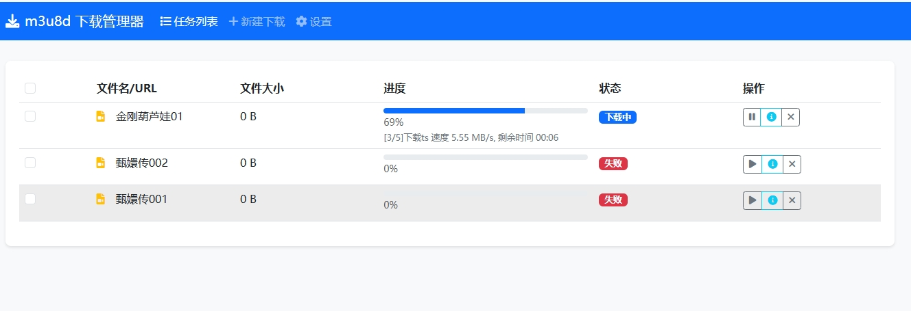
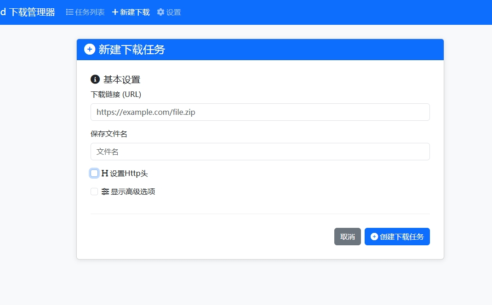
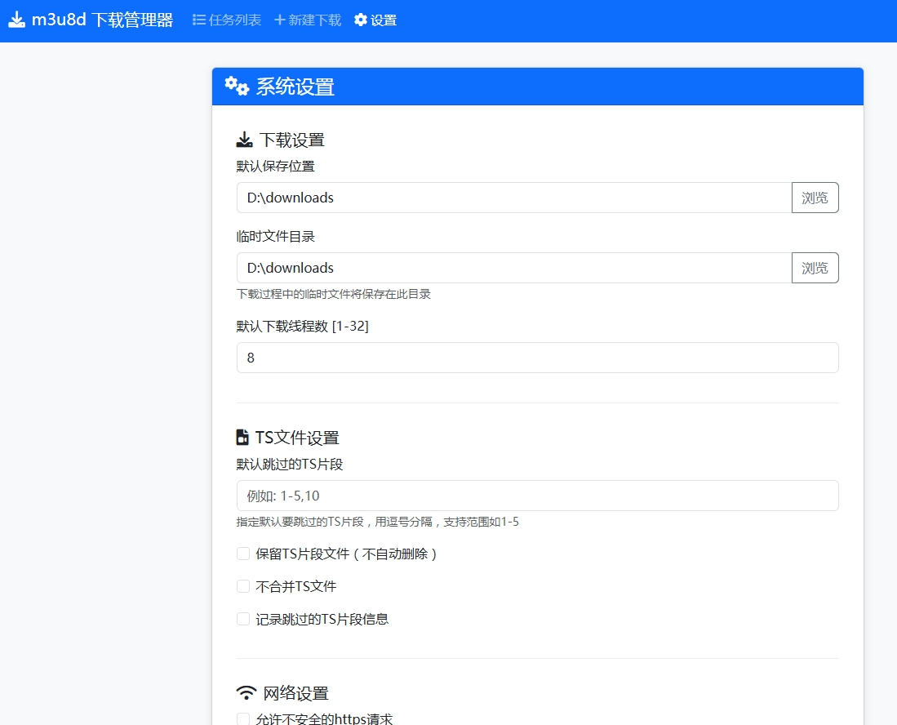

# m3u8dweb
https://github.com/orestonce/m3u8d 的web前端实现

#已实现功能
1. bootstrap前端： 系统设置、新建任务、任务列表（暂停、恢复、删除、3秒定时刷新）
* 
* 
* 
2. 后端有个线程定时取“等待中”的任务，然后按照指示进行下载。为简化实现，在同一时间下载的任务数最大为1。
3. 解析curl命令为http header信息（这点比qt版本的ui要清晰明白很多）
4. 支持设置http、https、socks5代理
5. 有[webapi文档](api.md)
6. 命令行支持auth-basic、设置数据库文件路径、设置监听地址
````bash
# 默认参数启动
./m3u8dweb

# 自定义端口和数据库路径
./m3u8dweb -listen :8081 -db ./data/downloads.db

# 启用认证
./m3u8dweb -auth-user admin -auth-pass password123

# 完整参数示例
./m3u8dweb -listen 0.0.0.0:80 -db /var/m3u8dweb/db.sqlite -auth-user admin -auth-pass securePass
````